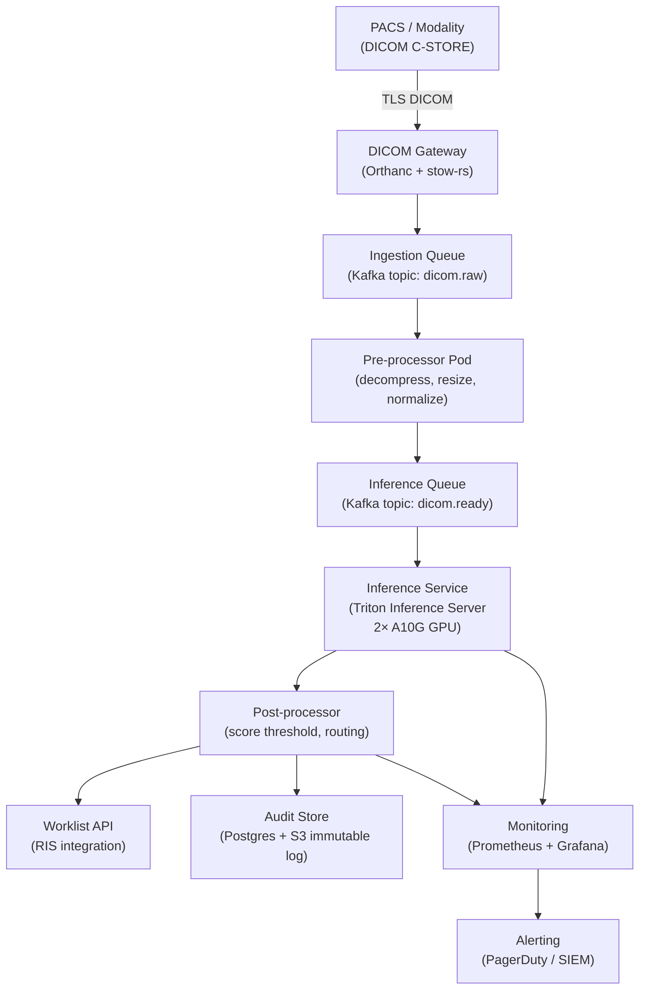

# Radiology Triage Assistant — Scenario Z

## Executive Summary

This system is a **real-time chest X-ray triage assistant** embedded in a hospital radiology workflow. A deep-learning model scores every incoming DICOM study for urgency (0–100) within 4 seconds, allowing radiologists to read the most critical studies first. The platform ingests up to 100 studies per minute at peak, processes multi-slice DICOM packages up to 80 MB, routes studies to radiologist worklists via a REST API, and emits a full audit trail for every prediction — satisfying FDA Software as a Medical Device (SaMD) and HIPAA data-residency requirements. Model versions are promoted only after dual sign-off; every production inference is logged with the exact model version, input hash, and output score for post-market surveillance.

All system metrics, logs, and audit records are tagged with `X-Model-Version` to ensure full traceability across the pipeline.

The system operates as a near-real-time (asynchronous) pipeline due to large DICOM payloads and processing constraints.

## Architecture Diagram

## Key Numbers

| Parameter | Value |
|---|---|
| Average throughput | 30 studies / min |
| Peak throughput | 100 studies / min |
| p95 end-to-end latency budget | 4 000 ms |
| p99 end-to-end latency budget | 7 000 ms |
| Max study size | 80 MB (multi-slice DICOM) |
| Model | EfficientNet-V2-M + custom head (~28 M params) |
| Model artifact size (TensorRT FP16) | ~110 MB |
| GPU hardware | 2× NVIDIA A10G (24 GB VRAM each) |
| CPU fallback | 4× c6i.4xlarge (CPU-only, degraded latency) |
| Estimated monthly infra cost | ~$4 200 (GPU nodes + storage + data transfer) |
| Availability SLO | 99.9 % (≤ 43.8 min downtime/month) |
| Prediction latency SLO (p95) | ≤ 4 000 ms |
| Audit log retention | 10 years (regulatory requirement) |
| Data residency | Single-region (us-east-1 default; configurable) |

## Navigation

| Area | Primary Artifact |
|---|---|
| Architecture | [architecture/architecture.md](architecture/architecture.md) |
| Pattern justification | [architecture/JUSTIFICATION.md](architecture/JUSTIFICATION.md) |
| ADR 0001 — GPU vs CPU serving | [architecture/adr/0001-gpu-vs-cpu-serving.md](architecture/adr/0001-gpu-vs-cpu-serving.md) |
| ADR 0002 — Async queue vs sync REST | [architecture/adr/0002-async-queue-vs-sync-rest.md](architecture/adr/0002-async-queue-vs-sync-rest.md) |
| ML Lifecycle | [lifecycle/lifecycle.md](lifecycle/lifecycle.md) |
| Model Registry spec | [lifecycle/model-registry.yaml](lifecycle/model-registry.yaml) |
| Dockerfile | [container/Dockerfile](container/Dockerfile) |
| Container README | [container/README.md](container/README.md) |
| OpenAPI spec | [api/openapi.yaml](api/openapi.yaml) |
| API examples | [api/examples/](api/examples/) |
| Capacity plan | [serving/capacity-plan.md](serving/capacity-plan.md) |
| SLOs | [serving/slos.yaml](serving/slos.yaml) |
| Load test plan | [serving/load-test-plan.md](serving/load-test-plan.md) |
| CI/CD pipeline | [cicd/.github/workflows/deploy-model.yml](cicd/.github/workflows/deploy-model.yml) |
| Monitoring alerts | [monitoring/alerts.yaml](monitoring/alerts.yaml) |
| Rollback runbook | [runbooks/rollback.md](runbooks/rollback.md) |

## Open Questions

1. **Regulatory classification depth** — Is this system classified as a Class II or Class III SaMD under 21 CFR Part 820? The answer changes whether we need a 510(k) clearance pathway and how strictly the model-promotion sign-off process must be documented. We need a regulatory affairs review before the first production deployment.

2. **RIS/PACS integration contract** — The worklist push currently assumes HL7 v2.5 ORM messages over MLLP. If the hospital uses FHIR R4 ServiceRequest instead, the post-processor and the OpenAPI contract for `/studies/{studyId}/result` need a second transport adapter. Confirm with the integration team on day one.

3. **DICOM de-identification boundary** — PHI is currently stripped at the DICOM Gateway before hitting Kafka. We need to confirm with the CISO whether the Kafka brokers and S3 audit bucket must be encrypted at rest with customer-managed keys (CMK) or if AWS-managed keys (SSE-S3) satisfy the BAA. This affects key-management cost and operational complexity significantly.
