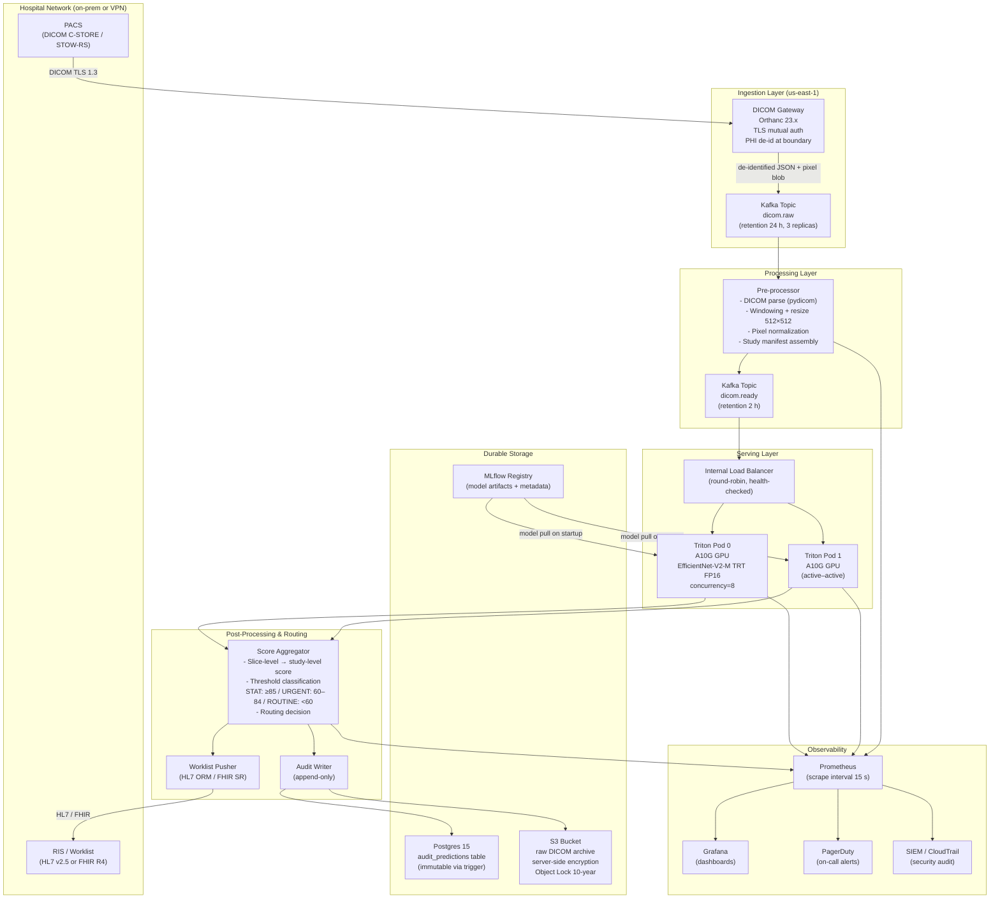

# Architecture

## System Context

The Radiology Triage Assistant sits between the hospital PACS (Picture Archiving and Communication System) and radiologist worklist management. It does **not** replace radiologist judgment — it reorders their reading queue so the most urgent studies are read first.

## Component Diagram



## Data Flow (per study)

```
T+0 ms    PACS sends DICOM C-STORE to DICOM Gateway
T+50 ms   Gateway de-identifies PHI, publishes to dicom.raw
T+200 ms  Pre-processor consumes, decompresses JPEG2000/RLE,
          assembles up to N slices into a 3D tensor (or picks top-k slices)
T+350 ms  Normalized tensor published to dicom.ready (≤ 2 MB after resize)
T+500 ms  Triton consumes, runs TRT FP16 inference, returns slice scores
T+700 ms  Score aggregator computes study-level urgency score
T+750 ms  Worklist push to RIS; audit record written to Postgres + S3
─────────────────────────────────────────────────────────────
p50 total: ~900 ms   p95 total: ~3 200 ms   budget: 4 000 ms
```

## Failure Modes & Mitigations

| Failure | Detection | Mitigation |
|---|---|---|
| GPU pod crash | Triton health probe fails | K8s restarts pod; second GPU pod absorbs load |
| Kafka lag spike | `kafka_consumer_lag > 500` alert | Auto-scale pre-processor pods (HPA) |
| Model version mismatch | `X-Model-Version` header check in post-processor | Alert `ModelVersionMismatch`; block promotion |
| PACS connectivity loss | Gateway connection count drops to 0 | Alert; studies queue in PACS until reconnect |
| Score threshold config error | p95 latency or STAT rate anomaly | Automated rollback runbook triggers |
| Audit write failure | Postgres write error rate > 0 | Inference blocked until audit store recovers (safety-critical path) |


## Backpressure & Queue Handling

- Kafka consumer lag is continuously monitored
- Horizontal autoscaling is triggered based on lag thresholds
- Maximum queue delay SLO: 2 seconds
- If delay exceeds threshold, alerts are triggered and traffic is throttled
  

## Security Boundaries

- PHI is de-identified **at the DICOM Gateway** before entering Kafka or any cloud-native service.
- All inter-service communication uses mTLS inside the cluster (Istio service mesh).
- S3 bucket has Object Lock (WORM) with 10-year retention — audit records cannot be deleted.
- Model registry access requires OIDC token with `ml-engineer` role; production promotion requires two approvals.
- All API endpoints require `Authorization: Bearer <jwt>` with `aud: radiology-triage`.
