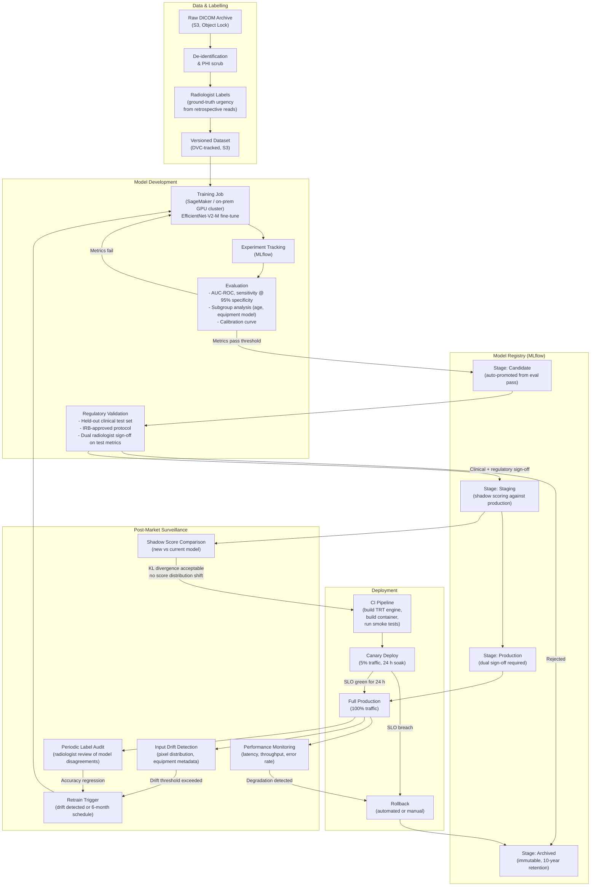

# ML Model Lifecycle

## End-to-End Lifecycle Diagram

## Stage Definitions

### Candidate
- Automatically promoted when training evaluation passes minimum thresholds:
  - AUC-ROC ≥ 0.92 on internal validation set
  - Sensitivity ≥ 0.95 at specificity 0.80 for STAT class
  - No subgroup AUC gap > 0.05 vs overall
- Artifact includes: model weights, TRT engine (if pre-built), eval report, dataset version hash

### Staging
- Deployed alongside production in **shadow mode**: same studies are scored by both models, but only the production model's score is sent to the RIS
- Shadow scoring runs for minimum 72 hours and 500 studies
- Promotion to Production blocked if KL divergence of score distribution > 0.15

### Production
- Requires **two explicit approvals** in the registry:
  1. ML Engineer sign-off (technical review: eval metrics, shadow comparison)
  2. Clinical Champion sign-off (radiologist review of shadow scoring disagreements)
- Only one model version in Production at any time
- `X-Model-Version` header in every API response and Kafka message corresponds to the Production model's registry tag (e.g., `efficientnet-v2m-triage-v1.4.2`)

### Archived
- All superseded Production and rejected Candidate versions
- Immutable; cannot be promoted back to Production without a new evaluation cycle
- Retained for 10 years per 21 CFR Part 820 requirements

## Retraining Triggers

| Trigger | Threshold | Action |
|---|---|---|
| Scheduled | Every 6 months | Full retrain from latest labelled dataset |
| Input drift | PSI > 0.25 on pixel intensity histogram | Alert + retrain within 30 days |
| Equipment metadata drift | New scanner model > 5% of volume not in training set | Targeted data collection + retrain |
| Label audit accuracy regression | Agreement with retrospective reads drops below 0.88 | Immediate retrain + clinical review |
| PACS upgrade | Any change to DICOM tag schema | Regression test; retrain if pixel pipeline changes |

## Data Governance

- Training data is sourced from consented retrospective studies under IRB approval
- De-identification uses DICOM PS 3.15 Profile: Basic Application Confidentiality
- Dataset versions are tracked in DVC with SHA-256 checksums of every manifest
- No training data leaves the designated data-residency region
- Feature store is not used; raw pixel tensors are the model input to maximize reproducibility
